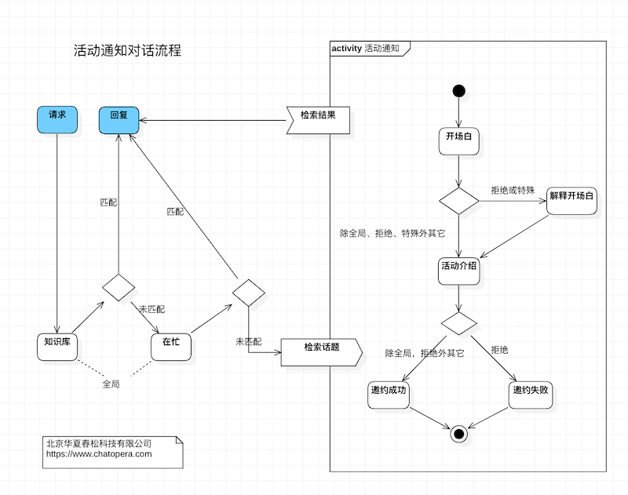

# Chatopera 对话模板

本源码库提供多个 **对话模板** 项目。

基于这些源码程序，您可以：

- 快速掌握 Chatopera 对话机器人开发，实现智能问答，智能客服等应用；
  以对话模板为脚手架，学习最佳实践，开发多轮对话；

- 快速掌握 Chatopera 机器人的系统集成。

开始阅读前，请完成：

- 注册 [Chatopera 云服务](https://bot.chatopera.com)；

- 安装 [多轮对话设计器](https://docs.chatopera.com/products/chatbot-platform/conversation/cde.html) （**兼容 Mac 和 Windows 操作系统**）。

> 提示：Chatopera 云服务是 Chatopera 机器人平台的公有云；如果您使用私有部署的 Chatopera 机器人平台，请用部署后的服务地址。

## 快速开始

使用 Chatopera 对话模板定制聊天机器人的流程如下：

- 注册 Chatopera 云服务：[https://bot.chatopera.com](https://bot.chatopera.com)
- 下载安装[多轮对话设计器](https://docs.chatopera.com/products/chatbot-platform/conversation/cde.html)
- 在 Chatopera 云服务上创建机器人
- 在多轮对话设计器上添加机器人
- 针对任意模板

  - 下载机器人知识库导入文件 `bot.faqs.json`
  - 下载机器人多轮对话文件 `bot.conversations.c66`
  - 导入知识库 `bot.faqs.json`
  - 导入多轮对话文件 `bot.conversations.c66`

- 在 Chatopera 云服务上测试和体验
- 使用 **多轮对话设计器** 更新、调试多轮对话

关于知识库文件 `bot.faqs.json` 和 多轮对话 `c66` 文件参考下文更多介绍。
还有的对话模板有词典和意图识别文件，参考 [使用 Chatopera CLI 导入机器人文件](#使用-cli-导入)。

## 模板目录

| 程序             | 语言  | 位置                                                              | 功能                                                                                                                       |
| ---------------- | ----- | ----------------------------------------------------------------- | -------------------------------------------------------------------------------------------------------------------------- |
| GuessNumber      | en_US | [projects/GuessNumber](./projects/GuessNumber)                    | 小游戏， Guess the secret number in the bot's hat.                                                                         |
| 预定机票         | zh_CN | [projects/预定机票](./projects/预定机票)                          | 预约机票                                                                                                                   |
| 天气查询         | zh_CN | [projects/天气查询](./projects/天气查询)                          | 实现一个能回答天气情况的聊天机器人                                                                                         |
| 活动通知         | zh_CN | [projects/活动通知](./projects/活动通知)                          | 实现一个能通知用户展会活动的聊天机器人                                                                                     |
| 招聘面试         | zh_CN | [projects/招聘面试](./projects/招聘面试)                          | 进行工作面试：提问技能知识、评估性格和心理素质，发送邮件报告面试过程。                                                     |
| 小笑话           | zh_CN | [projects/小笑话](./projects/小笑话)                              | 发送“笑话”，机器人返回一个笑话，逗您一乐。                                                                                 |
| 闲聊             | zh_CN | [projects/闲聊](./projects/闲聊)                                  | 闲聊，寒暄，6，000+ 条对话语料，修改 [faq.json](projects/闲聊/faq.json) 追加                                               |
| FeishuDevops     | zh_CN | [chatopera.feishu](https://github.com/chatopera/chatopera.feishu) | 飞书(Lark) Custom App, 集成 GitLab 实现 DevOps Issue 管理                                                                  |
| FeishuWeatherBot | zh_CN | [projects/FeishuWeatherBot](./projects/FeishuWeatherBot)          | [Chatopera 飞书应用](https://chatopera.feishu.cn/docs/doccnnLcv5AuenV1HHSvgVWbJmd)示例程序，一个能回答天气情况的飞书机器人 |

查看[所有模板](./projects)。

**对话模板**目录结构

```
.
├── README.md                  # 模板描述文件
├── bot.dicts.json             # 词典导入文件，包括引用词典、词汇表词典和正则表达式词典
├── bot.faqs.json              # 知识库导入文件，包括标准问、扩展问、分类等
├── bot.intents.json           # 意图识别导入文件，包含意图、说法、槽位等
├── bot.conversations.c66      # 多轮对话导入文件，包含脚本、函数等
├── flow.mdj                   # UML 对话流程文件，描述对话流程
└── flow.xlsx                  # Excel 话术文件，描述对话流程
```

有两个主要用途：**体验 Chatopera 机器人**；**定制化开发机器人**。

|                  |                          |                                           |
| ---------------- | ------------------------ | ----------------------------------------- |
| 体验机器人服务   |                          |                                           |
|                  | 体验对话模板机器人的效果 | [参考文档](./docs/import_bot_to_cloud.md) |
| 定制化开发机器人 |                          |                                           |
|                  | 基于 多轮对话设计器 开发 | [参考文档](./docs/development_cde.md)     |

## 导入对话模板

一个机器人的对话内容管理，包括词典管理、知识问答对管理、意图识别和多轮对话，分别对应着对话模板的文件：`bot.dicts.json`，`bot.faqs.json`，`bot.intents.json` 和 `bot.conversations.c66`。

有两种方式可以导入对话内容，但是它们对以上几个文件的支持不同。

### 使用 CLI 导入

[Chatopera CLI](https://docs.chatopera.com/products/chatbot-platform/integration/cli.html) 是连接 Chatopera 机器人平台，管理和维护资源的工具，包括一些常用的命令，辅助开发者实现和管理对话机器人，尤其是在有自动化或批量管理的需要时。

CLI 支持全部文件的导入，以下命令假设 `clientid`，`clientsecret` 等通用连接参数使用了 `.env` 设置，那么导入命令如下：

```
bot dicts --action import --filepath bot.dicts.json
bot faq --action import --filepath bot.faqs.json
bot intents --action import --filepath bot.intents.json
bot conversation --action import --filepath
bot dicts --action sync bot.conversations.c66
```

`.env` 文件使用，参考[文档链接](https://docs.chatopera.com/products/chatbot-platform/integration/cli.html#%E9%85%8D%E7%BD%AE%E5%8F%82%E6%95%B0)。

### 使用 Chatopera 机器人平台管理控制台

Chatopera 机器人平台管理控制台仅支持知识库（bot.faqs.json）和多轮对话（bot.conversations.c66）文件的导入。

进入[机器人管理控制台](https://bot.chatopera.com/dashboard)页面

- 进入知识库模块，点击【批量导入】，选择 bot.faqs.json
- 进入多轮对话模块，点击【导入】，选择 bot.conversations.c66

## 系统集成

API - 检索多轮对话(`POST /conversation/query`)。

### 快速开始

以 Node.js SDK 为例。

```
npm install @chatopera/sdk
```

开始聊天。

```
const {Chatbot} = require("@chatopera/sdk");
const bot = new Chatbot(clientid, clientsecret, provider);

# 请求多轮对话接口

let response = await bot.command("POST", "/conversation/query", {
    fromUserId: username,
    textMessage: answers.send,
    faqBestReplyThreshold: faqBest,
    faqSuggReplyThreshold: faqSugg,
})

# faqBest, faqSugg 分别为 FAQ 知识库最佳建议恢复阈值和建议回复阈值，取值为 (0,1)，并且 faqBest > faqSugg
```

系统集成详情打开[详细文档链接](https://docs.chatopera.com/products/chatbot-platform/integration/index.html)，了解其它语言 SDK 和更多 API 接口介绍。

# 建模工具

在实现聊天机器人前，尤其是多轮对话，完成一个任务，要先考虑好它的对话流程。然后再根据 [Chatopera 机器人平台](https://bot.chatopera.com) 提供的知识库、多轮对话和意图识别模块进行实现。

在对话模板中，我们提供两种类型的，完成建模任务的方案。

## Excel

查看使用 Excel 形式描述的话术建模文件，在对话模板项目中打开 `flow.xlsx`。

比如，[活动通知话术模板 Excel 文件](./projects/活动通知)。

## UML 流程图

对话模板中，有的带有[对话流程的建模项目]，即以"`.mdj`"结尾的文件，通常被命名为 `flow.mdj`，使用 StarUML 可以打开项目。

比如，一个对话流程图示例：[活动通知](./projects/活动通知)。



对话流程借鉴 UML Activity Diagram 建模，[入门参考文档](https://chatopera.blog.csdn.net/article/details/108133764)，内附元素定义、StarUML 软件下载等。

## Chatopera 机器人平台使用指南

本系列视频帮助您在 Chatopera 机器人平台上开发聊天机器人，通过自然语言交互的形式，定制开发聊天机器人，提升业务流程自动化。Chatopera 机器人平台包括知识库、多轮对话、意图识别和语音识别等组件，标准化聊天机器人开发，支持企业 OA 智能问答、HR 智能问答、智能客服和网络营销等场景。

<p align="center">
  <b><a href="http://ke.chatopera.com/course/2994143" target="_blank">上线聊天机器人！</a></b><br>
  <a href="http://ke.chatopera.com/course/2994143" target="_blank">
      
  </a>
</p>

## 技术支持

[反馈](https://github.com/chatopera/docs/issues/new/choose)

[其它](https://docs.chatopera.com/products/chatbot-platform/support.html)

# LICENSE

[Apache 2.0](./LICENSE)

[![chatoper banner][co-banner-image]][co-url]

[co-banner-image]: ./assets/8.png
[co-url]: https://www.chatopera.com
