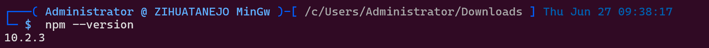
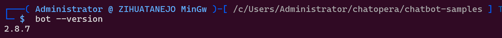
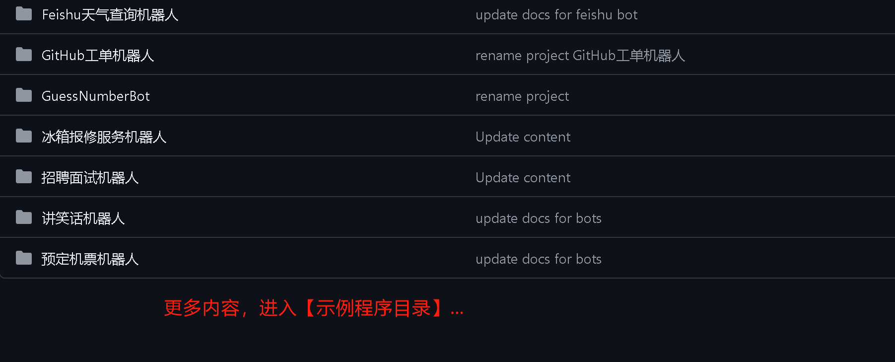

<div align=right>

[Chatopera 云服务](https://bot.chatopera.com/)　|　[入门教程](https://docs.chatopera.com/products/chatbot-platform/tutorials/index.html)　|　[文档中心](https://docs.chatopera.com/index.html)

</div>

# Chatopera 示例程序

[GitHub](https://github.com/chatopera/chatbot-samples/) | [Gitee](https://gitee.com/chatopera/chatbot-samples)

本源码库提供多个 [**示例程序**](./projects/) 项目，基于这些项目，您可以：

- 快速掌握 Chatopera 对话机器人开发，实现智能问答，智能客服等应用；
- 以对话模板为脚手架，学习最佳实践，开发多轮对话；
- 快速掌握 Chatopera 机器人的系统集成。

## 开始阅读前

* 请完成入门教程，[查看文档](https://docs.chatopera.com/products/chatbot-platform/tutorials/index.html)

## 工单

有关 [chatopera/chatbot-samples](https://github.com/chatopera/chatbot-samples) 的工单，提交到 -

[https://github.com/chatopera/docs/issues?q=label%3ASamples](https://github.com/chatopera/docs/issues?q=label%3ASamples)

## 安装 CLI

[CLI 命令行工具](https://docs.chatopera.com/products/chatbot-platform/references/cli.html)是自动化的脚本命令，使用 CLI 命令行工具可快速的导入或导出机器人语料。使用 CLI 工具，需要先安装依赖：

* Git - [Windows 安装指南](https://gitforwindows.org/) | [macOS](https://git-scm.com/download/mac) | [Linux](https://git-scm.com/downloads)
* Node.js - [安装指南](https://nodejs.org/zh-cn)

CLI 同时依赖操作系统的命令行终端，如 PowerShell, CMD Prompt, Bash Shell, etc.

打开命令行中断，比如 PowerShell，执行 `npm --version`，确认可以看到类似的输出。



证明 nodejs 已经安装成功。然后，执行：

```
npm install -g @chatopera/sdk
```

进行安装 CLI，上述命令执行后，在命令行执行 ``，确认可以看到类似这样的输出。



## 克隆代码

```
git clone https://github.com/chatopera/chatbot-samples.git
cd chatbot-samples
pwd # 得到代码路径 ROOT_PATH
```

## 使用 CLI 导入示例程序

首先，[安装 CLI 和克隆代码](https://github.com/chatopera/chatbot-samples?tab=readme-ov-file#%E5%AE%89%E8%A3%85-cli)，然后执行下面的步骤。

### 导入语料
将某个示例程序，导入到一个已有的聊天机器人。假设已经在 [https://bot.chatopera.com/dashboard](https://bot.chatopera.com/dashboard) 创建了一个聊天机器人，并获得了 ClientID 和 Secret 信息。 

接着**按照顺序，执行下面的命令**：

```
cd {{ROOT_PATH}}/projects/GitHub工单机器人 # 使用哪个示例程序，就进入哪个示例程序路径
bot env # 自动生成 .env 文件，然后更新 .env 文件中的 BOT_CLIENT_ID 和 BOT_CLIENT_SECRET
bot dicts --action import -f bot.dicts.json # 导出词典
bot faq --action import -f bot.faqs.json    # 导出知识库
bot intents --action import -f bot.intents.json # 导出意图识别
bot conversation --action import -f bot.conversations.c66 # 导出多轮对话
```

`{{ROOT_PATH}}` 是项目 [https://github.com/chatopera/chatbot-samples](https://github.com/chatopera/chatbot-samples) 存放的路径, 比如 `/c/Users/Administrator/chatbot-samples`。


### 导出语料
将目前 `.env` 文件中的机器人的语料导出为本地的语料文件。

```
cd {{ROOT_PATH}}/projects/GitHub工单机器人 # 使用哪个示例程序，就进入哪个示例程序路径
bot dicts --action export -f bot.dicts.json # 假设已经创建了 .env 文件，并设定 BOT_CLIENT_ID 和 BOT_CLIENT_SECRET
bot faq --action export -f bot.faqs.json
bot intents --action export -f bot.intents.json
bot conversation --action export -f bot.conversations.c66
```

## 更多提示

### 示例程序目录

查看[示例程序目录](./projects)。

[](./projects)

每个**示例程序**按照如下的结构组织。

```
根目录
├── README.md                  # 该项目的使用说明，必读
├── bot.dicts.json             # 词典导入文件，包括引用词典、词汇表词典和正则表达式词典
├── bot.faqs.json              # 知识库导入文件，包括标准问、扩展问、分类等
├── bot.intents.json           # 意图识别导入文件，包含意图、说法、槽位等
├── bot.conversations.c66      # 多轮对话导入文件，包含脚本、函数等
├── conversations              # 多轮对话文件解压后的内容，.c66 文件是 zip 压缩包
├── flow.mdj                   # UML 对话流程文件，描述对话流程，可能有
└── flow.xlsx                  # Excel 话术文件，描述对话流程，可能有
```

### 语料导入导出的更多介绍

了解导入导出语料，[查看文档](https://docs.chatopera.com/products/chatbot-platform/howto-guides/integration/cli-export-import.html)

### 设置命令快捷方式

在 shell profile 中设置如下命令, 比如 `~/.zshrc` or `~/.bashrc`。

```
export CHATBOT_SAMPLES={{ROOT_PATH}}
# export bot files into current work dir
alias botexport="$CHATBOT_SAMPLES/bin/export.sh"
# import bot files under current work dir
alias botimport="$CHATBOT_SAMPLES/bin/import.sh"
# package conversations folder as bot.conversations.c66
alias botconpac="$CHATBOT_SAMPLES/bin/conversation.package.sh"
```

现在，使用命令 `botimport` 和 `botexport` 完成导入 BOT 和导出 BOT 的操作，比如：

```
cd projects/GitHub工单机器人
botimport # 导入语料到聊天机器人
botexport # 导出聊天机器人到语料
```

# LICENSE

[Apache 2.0](./LICENSE)

[![chatoper banner][co-banner-image]][co-url]

[co-banner-image]: ./assets/8.png
[co-url]: https://www.chatopera.com
