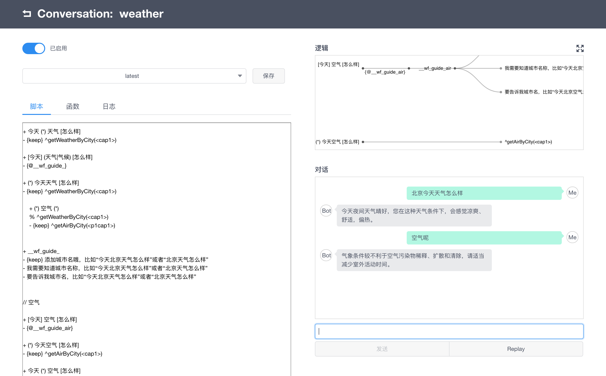

# Chatopera 多轮对话示例程序

本示例程序是使用[多轮对话设计器](https://www.chatopera.com/product/conversation-designer)设计导出的项目文件。
该项目打包后可导入到[智能问答引擎](https://www.chatopera.com/product/conversation-engine)中，作为多轮对话应用的运行时环境。

# 说明
该示例程序实现一个能回答天气情况的聊天机器人。

# 实现过程

## 文档

* [多轮对话设计器：脚本语法介绍](https://mp.weixin.qq.com/s/2RBchp-fqAw93Ebl9A8XRw)

* [多轮对话设计器：实现天气查询机器人的过程](https://mp.weixin.qq.com/s/wo8rs3E5f7aV7bssD61z4w)

* [多轮对话设计器：快速开始](https://mp.weixin.qq.com/s/wo8rs3E5f7aV7bssD61z4w)

## 在**多轮对话设计器**中测试

# 打包

# 导入到智能问答引擎

# LICENSE
[Apache 2.0](./LICENSE)

[![chatoper banner][co-banner-image]][co-url]

[co-banner-image]: https://user-images.githubusercontent.com/3538629/42383104-da925942-8168-11e8-8195-868d5fcec170.png
[co-url]: https://www.chatopera.com
