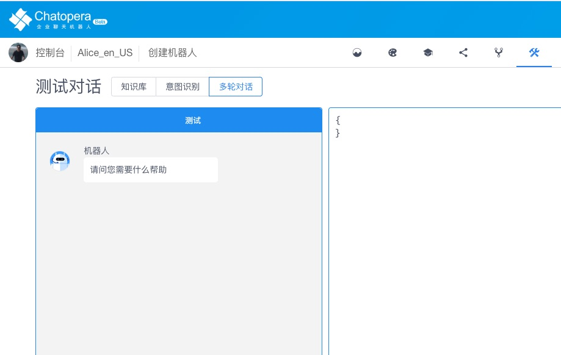

# Chatopera 多轮对话示例程序

本源码库提供多个示例程序。

基于这些源码程序，您可以：

- 快速掌握 Chatopera 对话机器人开发，实现智能问答，智能客服等应用；

- 以示例程序为模版，学习最佳实践，开发多轮对话；

- 快速掌握 Chatopera 机器人的系统集成。

开始阅读前，请完成：

- 注册 [Chatopera 云服务](https://bot.chatopera.com)；

- 安装 [多轮对话设计器](https://docs.chatopera.com/products/chatbot-platform/conversation.html)。

# 说明

| 程序   | 位置                                 | 功能                                           |
| ------ | ------------------------------------ | ---------------------------------------------- |
| 小叮当 | [projects/小叮当](./projects/小叮当) | 该示例程序实现一个能回答天气情况的聊天机器人。 |

进入目录查看快速开始。

## 示例程序目录结构

```
.
├── README.md
├── botarchive
│   ├── index.json                 # 项目描述
│   ├── plugin.js                  # 函数
│   ├── zh_CN.chatopera.ms         # 话题脚本 1
│   ├── zh_CN.profile.ms           # 话题脚本 2
│   └── zh_CN.weather.ms           # 话题脚本 N
├── package.json                   # 基于Node.js开发时的环境依赖描述
├── releases                       # 版本目录
│   └── ${应用名字}-1.0.0.c66        # 版本分发包
├── sample.env                     # 基于Node.js开发时的机器人远程调试配置信息
└── scripts                        #    基于Node.js开发时的工具脚本
    ├── archive.sh                 #    打包，将 botarchive 制作为发布包
    ├── bot                        #    bot命令行工具 wrapper
    ├── chat.sh                    #    和机器人连接，测试对话
    ├── deploy.sh                  #    将 botarchive 内容更新到远程机器人
    ├── install.sh                 #    安装依赖，需要先执行，其它脚本才能使用
    └── trace.sh                   #    实时打印机器人的日志
```

**该示例程序有两个主要用途：体验 Chatopera 机器人；定制化开发机器人。**

**在定制化开发环节，支持两种开发方法：1）使用 多轮对话设计器；2）基于 Node.js 环境开发。**

## 体验

使用示例程序体验 Chatopera 机器人的效果，作为一个定制化开发聊天机器人的产品，Chatopera 机器人用户体验怎么样呢？

您可以基于这些示例程序进行体验。

### 创建机器人

登陆 [Chatopera 云服务](https://bot.chatopera.com)，创建机器人，选择语言（中文简体，中文繁体或英语）。

> 根据体验的示例程序的语言选择语言，查看每个示例程序的 botarchive/index.json。

### 下载多轮对话文件

多轮对话文件在每个示例程序目录的`releases`文件夹内，以 `.c66` 文件结尾。

### 导入多轮对话

在 [Chatopera 云服务](https://bot.chatopera.com) 进入刚刚创建的机器人详情，从一级菜单导航至`多轮对话`。

点击`导入`，上传刚刚下载的`.c66`文件。


### 测试对话

在 [Chatopera 云服务](https://bot.chatopera.com) 进入机器人测试对话页面，选择 `多轮对话`，开始测试。



## 基于 多轮对话设计器 开发

首先，安装和下载多轮对话设计器：

[安装教程](https://docs.chatopera.com/products/chatbot-platform/conversation.html#%E5%A4%9A%E8%BD%AE%E5%AF%B9%E8%AF%9D%E8%AE%BE%E8%AE%A1%E5%99%A8)

然后，进入示例程序，比如 **小叮当**，下载 `releases` 文件，`releases`文件以`.c66`结尾。

最后，打开多轮对话设计器，点击“导入”，选择`.c66`文件。

## 基于 Node.js 开发

[Node.js](https://nodejs.org/download/) 是一个 JavaScript 运行时环境，基于 Node.js 可以快速开发后端或前段应用。 Chatopera 机器人平台提供的示例程序，支持使用 **多轮对话编辑器** 或 [Node.js](https://nodejs.org/download/)环境下调试多轮对话。

**多轮对话编辑器** 使用更方便，但是基于[Node.js](https://nodejs.org/download/)的开发环境，对于 Node.js 用户或软件开发者更友好。

在 Node.js 开发下，除了安装 Node.js 外，还需要

- 文本编辑器，比如 [Visual Code Studio](https://code.visualstudio.com/)，[Sublime Text](https://www.sublimetext.com/)，etc。

- Git

- 命令行控制台，Bash: Git Bash, Windows 用户; Terminal, Mac 用户；Linux Shell。

`命令行控制台`就是 Linux Shell 工具，Mac 下内置 Terminal，可以安装 [iterm2](https://www.iterm2.com/)。

### 下载代码

```
git@github.com:chatopera/chatbot-samples.git
```

### 配置

基于 Node.js 开发时，配置机器人连接信息。

```
cd projects/示例机器人项目
cp sample.env .env # 编辑 .env 文件
```

修改 `.env` 文件。

| key                | default                   | description                            |
| ------------------ | ------------------------- | -------------------------------------- |
| BOT_PROVIDER       | https://bot.chatopera.com | BOT 服务地址                           |
| BOT_CLIENT_ID      | 无默认，必填              | 从 PROVIDER 创建机器人，获得           |
| BOT_SECRET         | 无默认，必填              | 从 PROVIDER 创建机器人，获得           |
| BOT_USERNAME       | testuser                  | 测试对话的用户                         |
| BOT_FAQ_BEST_REPLY | 0.8                       | 知识库最佳回复阀值                     |
| BOT_FAQ_SUGG_REPLY | 0.6                       | 知识库建议回复阀值                     |
| BOT_TRACE_LEVEL    | DEBUG                     | trace 跟踪服务器端机器人，日志输出级别 |

### 部署

```
scripts/deploy.sh 文件夹名
```

将部署文件夹的内容，使用 .env 文件中的远程机器人配置信息。

### 对话

```
scripts/chat.sh 文件夹名
```

将启动聊天窗口，使用 .env 文件中的远程机器人配置信息。

### 查看日志

调试脚本/函数过程中，实时查看日志，日志信息包括：脚本部署更新情况；函数中 debug 的输出。

```
scripts/trace.sh 文件夹名
```

将启动日志窗口，使用 .env 文件中的远程机器人配置信息。

### 打包

```
scripts/archive.sh 文件夹名
```

将打包文件夹内的 `botarchive`。

打包后得到.c66 文件，在**聊天机器人多轮对话控制台**上传。

### 撰写脚本和函数

更新 `botarchive` 下的脚本和函数文件，实现对话逻辑。

教程和语法参考[文档中心：多轮对话](https://docs.chatopera.com/products/chatbot-platform/conversation.html)。

### 集成

API - 检索多轮对话。

### 快速开始

以 Node.js SDK 为例。

```
npm install @chatopera/sdk
```

开始聊天。

```
const Chatbot = require("@chatopera/sdk").Chatbot;
client = new Chatbot(clientid, clientsecret, provider);

# 请求多轮对话接口

bot.command("POST", "/conversation/query", {
fromUserId: username,
textMessage: answers.send,
faqBestReplyThreshold: faqBest,
faqSuggReplyThreshold: faqSugg,
})
```

其它语言 SDK 和更多 API 接口介绍，系统集成详情参考：[链接](https://docs.chatopera.com/products/chatbot-platform/integration.html)。

# LICENSE

[Apache 2.0](./LICENSE)

[![chatoper banner][co-banner-image]][co-url]

[co-banner-image]: https://user-images.githubusercontent.com/3538629/42383104-da925942-8168-11e8-8195-868d5fcec170.png
[co-url]: https://www.chatopera.com
