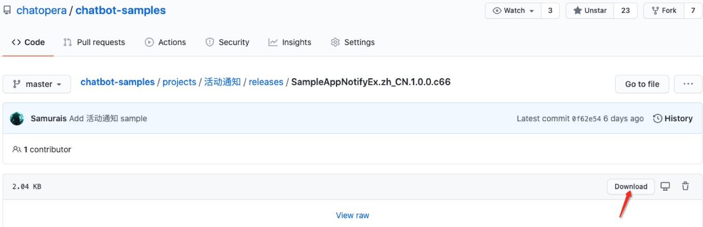
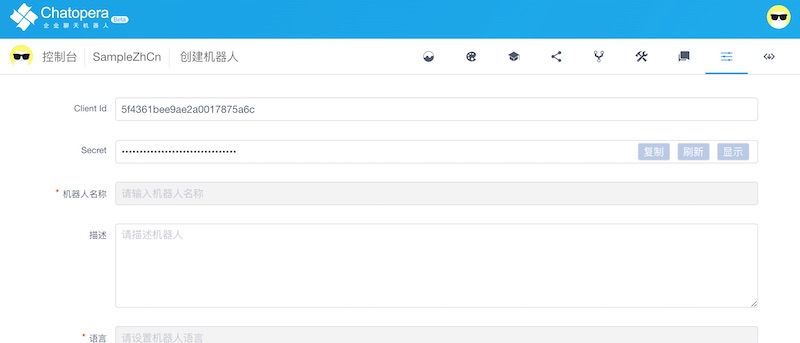
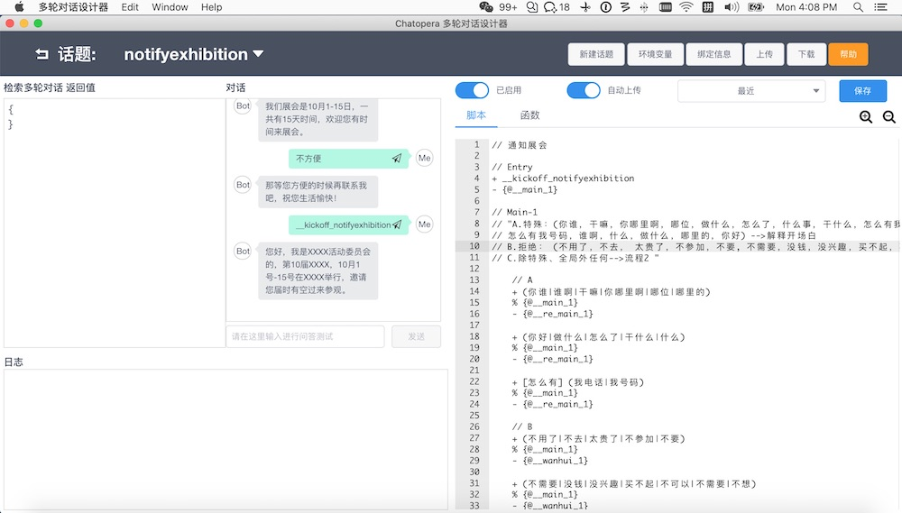

## 基于 多轮对话设计器 开发

### 安装和下载多轮对话设计器

安装和下载多轮对话设计器：[安装教程](https://docs.chatopera.com/products/chatbot-platform/conversation/cde.html)。

### 下载对话应用发布包

选择对话模板，比如 [**活动通知**](https://github.com/chatopera/chatbot-samples/tree/master/projects/%E6%B4%BB%E5%8A%A8%E9%80%9A%E7%9F%A5)，下载 `bot.conversations.c66` 文件，机器人对话应用发布文件以`.c66`结尾。



### 登陆 Chatopera 机器人平台

登陆 Chatopera 机器人平台，公有云服务地址为 [https://bot.chatopera.com](https://bot.chatopera.com)。选择语言（中文简体，中文繁体或英语）。

设置机器人语言，比如 `zh_CN`，各个对话模板对应的语言参考[https://github.com/chatopera/chatbot-samples](https://github.com/chatopera/chatbot-samples)。

在“设置页面”得到`ClientId`和`Secret`。



### 导入发布包

打开多轮对话设计器，添加机器人，在弹出表单中，填入`ClientId`和`Secret`。

然后点击“导入”，选择刚刚下载的`.c66`文件。

### 修改话术并测试

完成导入后，在“操作”中点击“打开”。



以活动通知为例，导入后，点击“上传”，提示上传成功。然后测试对话。

在测试对话输入窗口，发送文本。

```
我：在忙
BOT：那等您方便的时候再联系我吧，祝您生活愉快！
我：__kickoff_notifyexhibition
BOT：您好，我是XXXX活动委员会的，第10届XXXX，10月1号-15号在XXXX举行，邀请您届时有空过来参观。
```

修改话题，在右侧脚本和函数编辑窗口更改，然后“保存”-“上传”；再次进行测试。

更多内容参考[文档中心](https://docs.chatopera.com/products/chatbot-platform/conversation/index.html)。

返回[文档根页面](../)。
