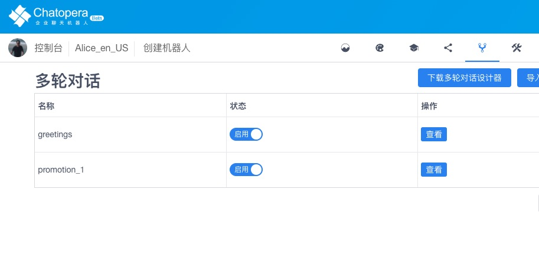
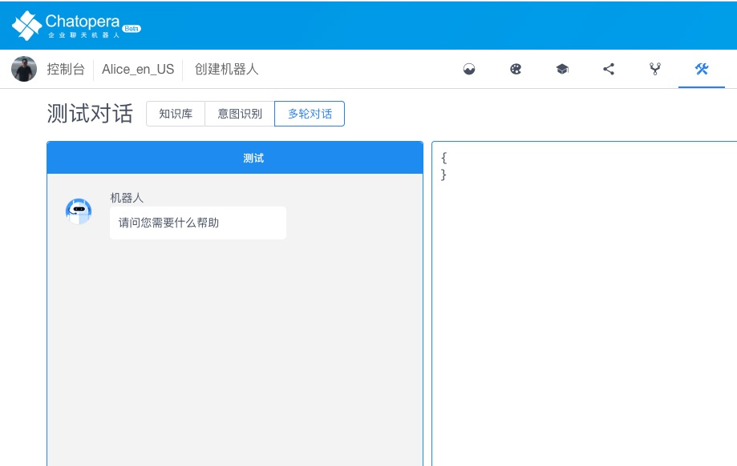

[主页](https://github.com/chatopera/chatbot-samples)　|　[Chatopera 云服务](https://docs.chatopera.com/)　|　[开发者文档](https://docs.chatopera.com/)　|　[博客专栏](https://chatopera.blog.csdn.net/)

# 体验对话模板机器人的效果

作为一个定制化开发聊天机器人的产品，Chatopera 机器人用户体验怎么样呢？

以下介绍如何导入并体验对话模板里的聊天机器人。

## 下载多轮对话文件

对话应用发布包在对话模板目录的文件夹内，文件名：`bot.conversations.c66`。

## 创建机器人

登陆 Chatopera 机器人平台，公有云服务地址为 [https://bot.chatopera.com](https://bot.chatopera.com)。选择语言（中文简体，中文繁体或英语）。

根据对话应用发布包中包含的语言，设置机器人语言，比如 `zh_CN`，各个对话模板对应的语言参考[https://github.com/chatopera/chatbot-samples](https://github.com/chatopera/chatbot-samples)。

## 导入多轮对话

在 [Chatopera 机器人平台](https://bot.chatopera.com) 进入刚刚创建的机器人详情，从一级菜单导航至`多轮对话`。

点击`导入`，上传刚刚下载的`.c66`文件。

## 测试对话

在 [Chatopera 机器人平台](https://bot.chatopera.com) 进入机器人测试对话页面，选择 `多轮对话`，开始测试。

返回[文档根页面](../)。
