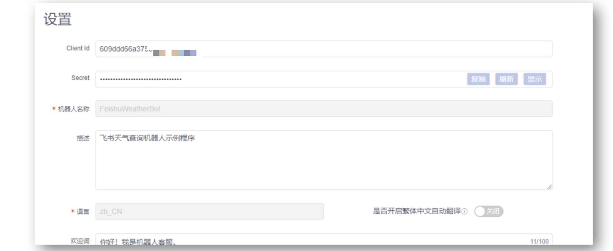
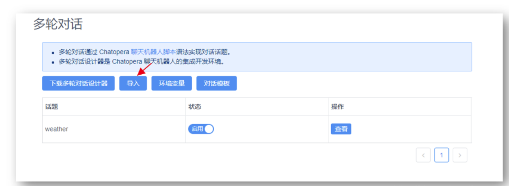
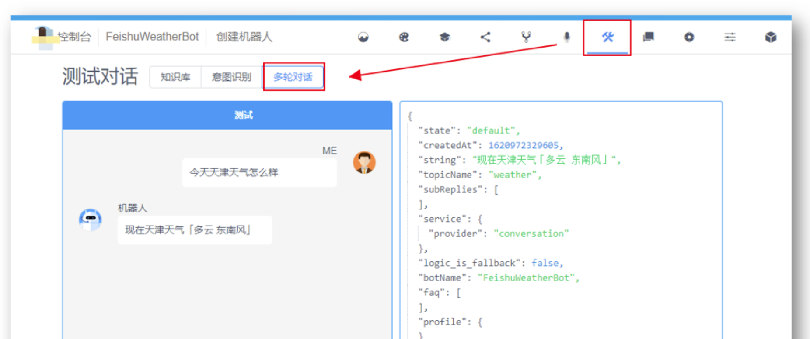
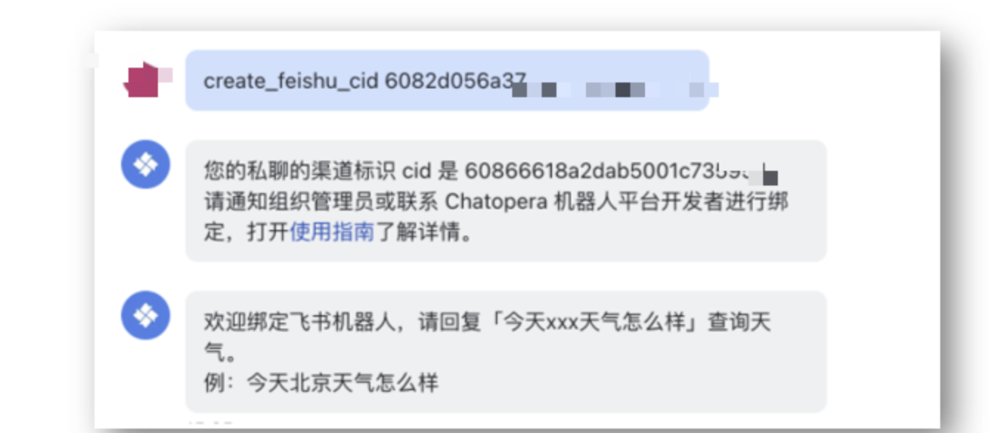
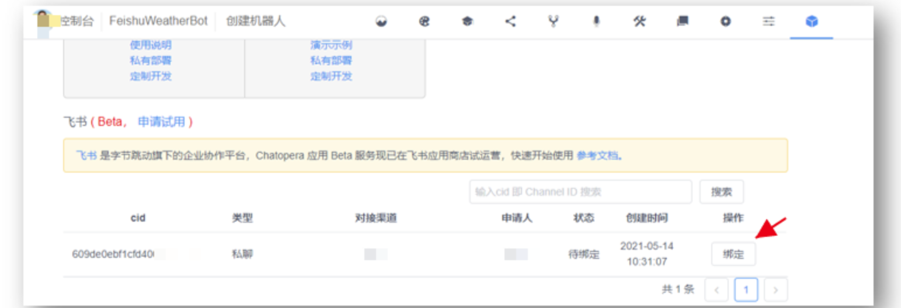
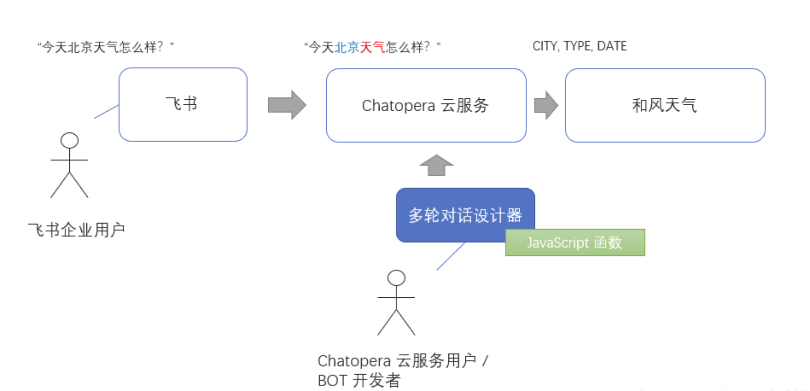
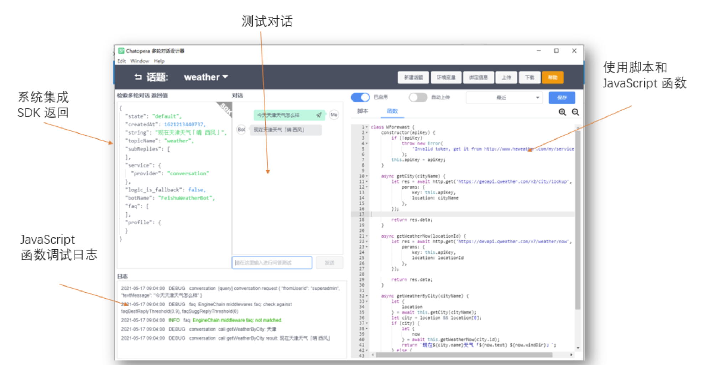
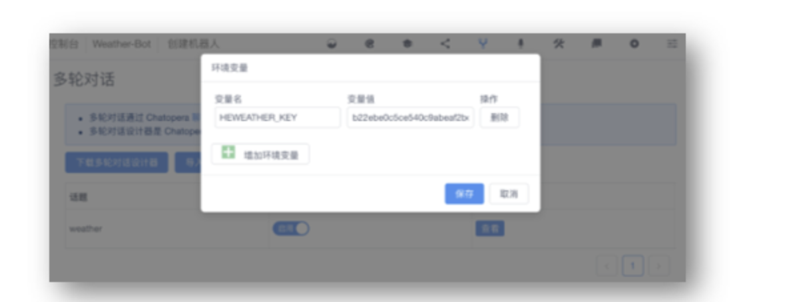

# Feishu天气查询机器人

## 智能对话机器人让办公更智能

飞书是字节跳动旗下企业协作平台，整合即时沟通、视频会议、日历、云文档、OKR、企业邮箱、服务台等功能于一体，成就组织和个人，更高效、更愉悦。

Chatopera 飞书应用可以帮助企业快速定制知识库和多轮对话，让办公更智能！

比如，我是企业的 HR，我怎么样让同事们可以在飞书上快速获得公司的开会制度、休假制度和绩效考核制度的相关信息？我是企业的软件服务研发人员，我怎么样在飞书上实现基于人机自然语言交互的 ChatOps 服务 ...

==只需要在飞书应用目录中安装 Chatopera 应用，就可以增加丰富的技能，而且是通过无代码或低代码的方式。==

==Chatopera 机器人平台是开发 BOT 服务的工具，而飞书是上线 BOT 服务的渠道。==

这个定制化 BOT 和上线的过程是非常简单的，本文的主要目的就是展示这个过程，我们一起来实现一个能查询天气的 BOT！

## 创建 Chatopera 机器人

登陆 Chatopera 云服务（[https://bot.chatopera.com](https://bot.chatopera.com)） ，在管理控制台，点击【创建机器人】，这次我们创建的机器人的名字是 【FeishuWeatherBot】，描述是【飞书天气查询机器人示例】。


成功创建后进入【设置】页面查看 Client Id，在飞书私聊或群聊中，绑定 Chatopera 应用对应的机器人时需要使用。





## 上传 Chatopera 机器人多轮对话脚本

多轮对话是 Chatopera 机器人中，对话管理的一个模块，多轮对话的特点是通过脚本语法设计对话，并通过函数满足更灵活的需求，多轮对话使用多轮对话设计器开发，支持导入导出操作，在不同的机器人之间可以复用。现在您不需要了解更多，只需要按照下面的操作点击完成现成的对话的导入，在本文的最后，通过延伸阅读的资源链接掌握详细的使用。

首先，通过链接下载天气查询多轮对话（地址1：[https://dwz.chatopera.com/8Iv25H](https://dwz.chatopera.com/8Iv25H) 地址2：[https://dwz.chatopera.com/4J0q7l](https://dwz.chatopera.com/4J0q7l)），该下载文件以 c66 结尾，该后缀代表是 Chatopera 多轮对话的封装的文件。

然后，进入 Chatopera 机器人【多轮对话】模块，点击【导入】按钮上传刚下载的 c66 文件。



测试对话，进入 Chatopera 测试页面。比如，发送【今天天津天气怎么样】，得到回复如【现在天津天气多云】。



那么，为什么会得到这样的回复？本文后续内容将会简单的介绍工作原理，我们继续看如何在飞书上使用。

## 飞书绑定机器人
飞书内使用 Chatopera 机器人，需要组织管理员先安装 Chatopera 应用，然后该应用就会出现在飞书客户端的工作台 Workplace，管理员安装 Chatopera 应用指南（[https://dwz.chatopera.com/o7770O](https://dwz.chatopera.com/o7770O)）。

组织内安装 Chatopera 应用后，在客户端使用快捷搜索或在工作台可以找到 Chatopera 应用，开始进入对话。


在飞书客户端，进入 Chatopera 应用对话窗口，发送 ```create_feishu_cid clientId ```创建机器人渠道，此时 Chatopera 应用回复了 CID 信息，即飞书渠道标识，该渠道标识用于在 Chatopera 云服务绑定飞书渠道。



进入 Chatopera 云服务中该 Chatopera 机器人的管理控制台，进入【系统集成】页面，滑动至【飞书】板块，通过搜索或在列表中，找到该飞书渠道，点击【绑定】并【确认】。



此时，飞书渠道得到通知，绑定完成。下面，就可以在飞书上使用 Chatopera 机器人了，是不是很简单？

## 在飞书客户端和机器人对话
按提示发送对应信息查询。


选择实现一个查询天气的应用，仅为简单说明目的，在 Chatopera 云服务内，用户可以满足实际业务上的任意的需求。

## 工作原理

在本示例程序中，天气信息来源自和风天气开发者 API ( [https://www.qweather.com/](https://www.qweather.com/) )，工作过程如下。



- Chatopera 云服务用户上传多轮对话 c66 程序，该程序是由 BOT 开发者使用多轮对话设计器开发并导出，分享
- 飞书用户根据提示获得使用说明，并使用自然语言对话
- 使用飞书用户查询中的信息请求和风天气接口并返回结果

==在多轮对话设计器中，开发者可以自由的发挥创造力 - Chatopera 机器人平台是一个无代码或低代码的可编程的定制 BOT 的平台！==



如果您需要在实际中使用这个程序，您需要自行申请和风天气的开发者 TOKEN （ [https://dev.qweather.com/](https://dev.qweather.com/) ）。默认情况下，是 Chatopera 申请的一个和风天气的 TOKEN，该 TOKEN 每天只有 1,000 次查询额度，以和风天气官方为准。





详细使用文档：[https://dwz.chatopera.com/GQTH16](https://dwz.chatopera.com/GQTH16)

