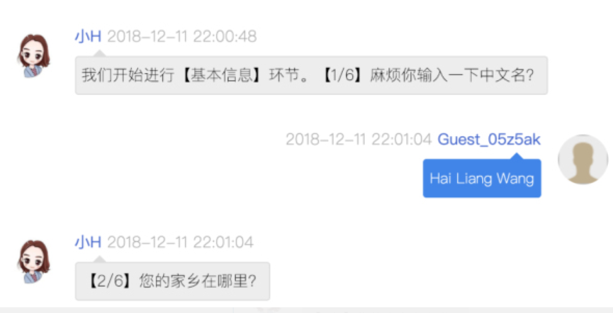

# 招聘面试机器人

## 背景介绍

在 Chatopera，我们实现了一个 HR 招聘助手机器人，我希望她能有效的考核我们的候选人，然后进行终面。

回想过去的面试经历，高效的面试是在较短时间内完成多轮面试，快速给出评估，但是成本也很大，一般的企业是承担不起的，那么我们用机器人问答的方式去做，会是一个很好地选择。

比如，我们把面试分成不同阶段：【1】基本信息；【2】技能评测；【3】工作偏好；【4】心理测试。这几项都是有固定的话术和流程，用 Chatopera 的产品实现起来很适合。

技能评测是一个重要环节，我们有不同的岗位，应聘者可以选择他（她）想入职的岗位，做对应的测试题，这些题目是我们为每个岗位量身定做的。

比如，这两个岗位的题，还挺难的，有相关技能的朋友可以来看看自己能做对多少。

在工作偏好中，我们问了一些常见问题，在心理测试中，我们出了很多选择题。

完成整个过程，大概需要 10 分钟到 30 分钟，超出 30 分钟，就会认为该候选人不合格。

作为招聘者，我需要得到这个面试的报告，当面试结束，HR 面试小助手会通过大数据分析整理数据，秒出结果，发送到企业 HR 的邮箱。

这样看起来还不错，接下来我就要决定是否和这位心仪的候选人见面！更重要的是这份儿格式化结构化的报告可以填充到企业的大数据人才仓库中，这个价值是显而易见的。

## 安装和配置

### 在 Chatopera 云服务中创建机器人

### 导入知识库

下载 [知识库 JSON 文件](./faq.json)，在机器人控制台的知识库页面导入 JSON 文件。

### 导入多轮对话

下载 [多轮对话发布包 c66 文件](./releases/SampleZhCn.zh_CN.1.0.0.c66)，在机器人控制台的多轮对话导入 c66 文件。

## 集成到网站

可使用 春松客服 发布该机器人给面试者使用，[春松客服部署](https://docs.chatopera.com/products/cskefu/deploy.html) 和 [春松客服里的机器人](https://docs.chatopera.com/products/cskefu/work-chatbot.html)。

## 在多轮对话设计中调试机器人

下载安装多轮对话设计器，参考 [文档](../../README.md)。

# 其它文章

[Chatopera：HR 机器人让每次面试都值得记忆](http://www.ctiforum.com/news/guonei/548654.html)
