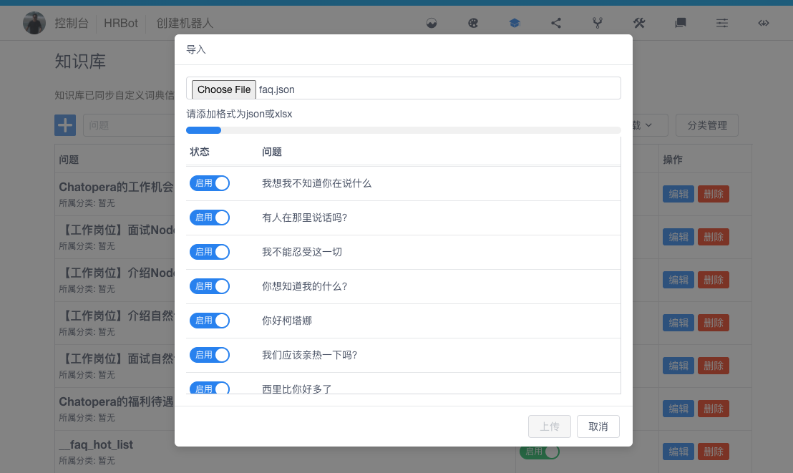

# Chatbot 闲聊机器人

语料来自 [CSDN 下载频道](https://download.csdn.net/)，闲聊语料资源较多，可参考 [faq.json](./faq.json) 中的格式追加。

## 导入知识库

知识库文件：[faq.json](./faq.json)

## 导入多轮对话

多轮对话文件：[c66 发布包](./releases)

下载安装多轮对话设计器，参考 [文档](../../README.md)。

## 在多轮对话知识库中调试

